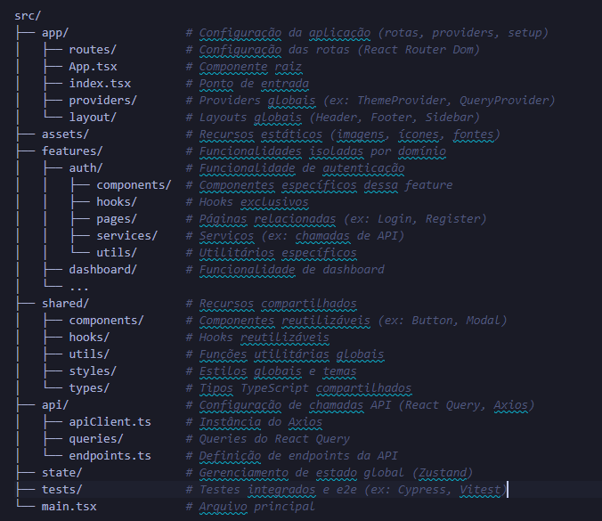
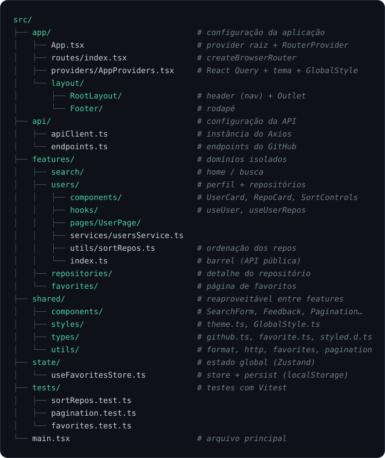

# GitHub Explorer

Um app que busca um usuário do GitHub e mostra os repositórios mais estrelados
dele. Fiz como resposta ao desafio front-end da Desbravador. É tudo client-side:
consome direto a API pública do GitHub, sem backend.


## O que dá pra fazer

- Buscar um usuário pelo login
- Ver o perfil dele (avatar, bio, seguidores, seguindo, e-mail e localização)
- Listar os repositórios ordenados por estrelas (decrescente) e trocar a ordem —
  por estrelas, nome ou data de atualização, crescente ou decrescente
- Paginar a listagem
- Abrir o detalhe de um repositório (estrelas, forks, watchers, issues, linguagem,
  licença, tópicos e link pro GitHub)
- Favoritar repositórios: ficam salvos no navegador (localStorage), aparecem na
  home e numa página só deles

Carregamento, erro e estado vazio são tratados em todas as telas.

## Rodando o projeto

Precisa de Node 18+. Uso **pnpm** aqui, mas funciona igual com npm ou yarn.

```bash
# instalar as dependências
pnpm install

# rodar em desenvolvimento (http://localhost:5173)
pnpm dev

# checar os tipos
pnpm typecheck

# build de produção
pnpm build

# pré-visualizar o build
pnpm preview

# rodar os testes
pnpm test
```

> Com npm é o mesmo, só trocar `pnpm` por `npm run` (ex.: `npm run dev`).

### Token do GitHub (recomendado)

Sem autenticação, a API do GitHub libera só 60 requisições por hora por IP. Com um
token isso sobe pra 5.000/h. É opcional, mas se você buscar bastante vai esbarrar
no limite.

1. Gere um token em [github.com/settings/tokens](https://github.com/settings/tokens)
   (pode ser um _classic_ sem marcar nenhum scope — só leitura de dados públicos já basta)
2. Copie `.env.example` para `.env` e cole o token:

   ```
   VITE_GITHUB_TOKEN=seu_token_aqui
   ```

3. Reinicie o dev server.

Como é um app client-side, use sempre um token só de leitura pública e nunca faça
deploy com ele exposto.

## Como eu organizo o projeto

Gosto de estruturar meus projetos React numa arquitetura **feature-based**: cada
domínio vive isolado em `features/`, e só o que é realmente genérico sobe pra
`shared/`. Assim dá pra entender e mexer numa feature sem caçar arquivo espalhado
pelo projeto inteiro.

Essa é a estrutura base que eu sigo:



E foi assim que ela ficou aqui:



Pasta por pasta:

- **`app/`** — o que liga tudo: rotas (`routes/`), providers (React Query + tema em
  `providers/`) e o layout raiz com header e footer (`layout/`)
- **`api/`** — o cliente Axios (`apiClient.ts`) e os endpoints do GitHub
  (`endpoints.ts`). Só a configuração; quem busca os dados é cada feature
- **`features/`** — os domínios: `search/` (home), `users/` (perfil + repositórios),
  `repositories/` (detalhe) e `favorites/` (página de favoritos)
- **`shared/`** — o reaproveitável entre features: componentes, estilos/tema, tipos
  da API e utilitários
- **`state/`** — estado global de verdade com **Zustand**: aqui, a store de
  favoritos, persistida no localStorage
- **`tests/`** — os testes de unidade com **Vitest** (ordenação, paginação e favoritos)

Algumas regras que eu sigo pra não virar bagunça:

- **feature não importa de outra feature.** Se `users` precisasse de algo de
  `repositories`, esse algo estaria no lugar errado → vai pra `shared/`
- cada feature expõe só o que é público por um **barrel** (`index.ts`); o resto é privado
- import por **alias `@/`** no lugar de `../../../`
- cada componente/página fica numa pasta com seu próprio `style.ts`
  (styled-components), importado como `import * as S` e usado como `<S.Container>`

## Por que styled-components (e não Tailwind)

Dava pra ir de Tailwind, que é ótimo pra prototipar rápido. Preferi
**styled-components** de propósito: como é um teste, quis mostrar domínio de CSS de
verdade — escrever o estilo na mão, pensar hierarquia, responsividade e estados, em
vez de compor tudo com utility classes.

E casou bem com a forma como organizo o código:

- cada componente/página tem seu `style.ts` do lado — o estilo mora junto do
  componente, mas separado do JSX, que fica limpo (sem `className` gigante)
- os estilos viram uma pequena API semântica (`<S.Card>`, `<S.Title>`): dá pra ler a
  estrutura da tela só olhando o markup
- tema tipado (cores, fontes, breakpoints do Bootstrap) via `ThemeProvider`, então
  não tem hex solto espalhado pelo projeto
- props dinâmicas direto no estilo (`$active`, `$compact`) sem string condicional de classes

Resumindo: Tailwind entrega velocidade; aqui a escolha foi mostrar controle sobre o CSS.

## Rotas

| Rota                           | Tela                            |
| ------------------------------ | ------------------------------- |
| `/`                            | Busca + favoritos recentes      |
| `/favorites`                   | Todos os favoritos              |
| `/user/:username`              | Perfil + repositórios           |
| `/user/:username/repo/:repo`   | Detalhe do repositório          |

## O que usei

- **React 19 + TypeScript + Vite**
- **React Router** — rotas
- **TanStack Query (React Query)** — consumo e cache da API
- **Axios** — requisições
- **Zustand** (+ middleware `persist`) — favoritos no localStorage
- **styled-components** — estilos, com breakpoints no padrão do Bootstrap
  (576 / 768 / 992 / 1200 / 1400px)
- **lucide-react** — ícones
- **Vitest** — testes (ordenação, paginação e favoritos)

## API

Bate direto na API pública do GitHub:

- `GET /users/{username}` — dados do usuário
- `GET /users/{username}/repos` — repositórios do usuário
- `GET /repos/{owner}/{repo}` — detalhe de um repositório

---

Feito por **Romero Almeida** — [www.romeroalmeida.tech](https://www.romeroalmeida.tech)
